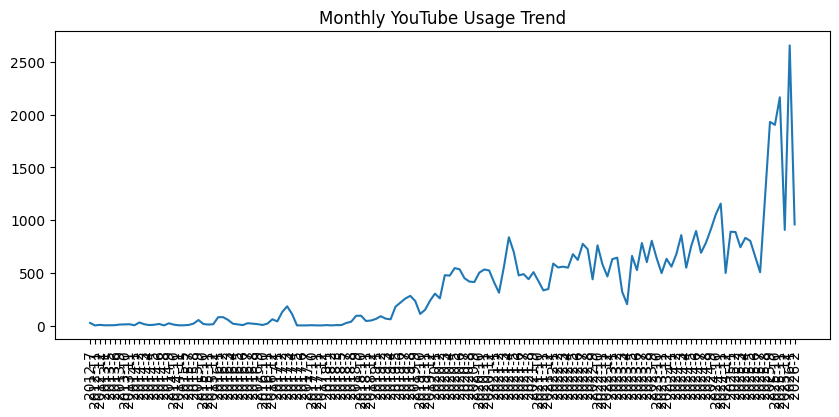

# 📊 YouTube Behavioral Analytics -- 14-Year Digital Consumption Study

## 📌 Project Overview

This project analyzes 14 years (2012--2026) of YouTube watch history
using Python and Power BI to understand long-term digital consumption
behavior.

The analysis includes: - JSON data wrangling and preprocessing -
Multi-timezone behavioral modeling (India ↔ Arizona transitions) -
Session reconstruction using inactivity gap logic - Engagement
estimation through session duration - Interactive Power BI dashboard
visualization

------------------------------------------------------------------------

## 🧰 Tools & Technologies

-   Python (Pandas, NumPy, Matplotlib)
-   Google Colab
-   Power BI
-   DAX Measures
-   Google Takeout (Data Source)

------------------------------------------------------------------------

## 🔧 Data Engineering Highlights

### 1️⃣ JSON Flattening

Converted nested Google Takeout JSON into structured analytical format.

### 2️⃣ Timezone-Aware Processing

Implemented boundary logic to preserve local behavioral patterns during
international relocation: - India → Arizona (Aug 2025) - Arizona → India
(Dec 2025) - India → Arizona (Jan 2026)

### 3️⃣ Sessionization

Defined new session when inactivity gap \> 30 minutes.

Results: - Total Sessions: \~9,000+ - Avg Videos per Session: \~6 -
Median Session Duration: \~9 minutes

------------------------------------------------------------------------

## 📈 Key Insights (Python Analysis)

### 🔹 Volume Growth Over Time
 \
Clear acceleration in consumption post-2019, peaking in 2025.

### 🔹 Monthly Usage Trend
 \
Seasonal spikes aligned with professional transitions and academic
cycles.

### 🔹 Hourly Viewing Pattern

Strong late-evening behavioral cluster, consistent across timezones.

### 🔹 Weekend vs Weekday Behavior

Higher intensity and longer sessions during weekends.

### 🔹 Channel Concentration

More inclined toward stock market and politics related contents.

------------------------------------------------------------------------

## 📊 Power BI Dashboard Structure

### 🔹 Page 1 -- Overview

### 🔹 Page 2 -- Behavioral Patterns

### 🔹 Page 3 -- Content Behavior

🔗 **Dashboard Link:** (--------------)

------------------------------------------------------------------------

## 🏢 Management Recommendations

### 1️⃣ Prime Taste Window Strategy

Identify peak viewing hour and offer a 1-hour ad-free experience without
requiring subscription registration.\
This reduces friction and increases premium conversion probability.

### 2️⃣ Adaptive Curated Advertising

Use longitudinal viewing pattern shifts to dynamically adjust
advertisement themes.\
Align ads with evolving content preferences to improve engagement and
monetization efficiency.

------------------------------------------------------------------------

## 🔐 Data Privacy Notice

Raw YouTube watch history data is excluded from this repository for
privacy reasons.

To reproduce this project: 1. Download your own YouTube Watch History
from Google Takeout. 2. Place `watch-history.json` in the `/data`
folder. 3. Run the notebook.

------------------------------------------------------------------------

## 🚀 Why This Project Matters

This project demonstrates: - Longitudinal behavioral analytics -
Timezone-aware modeling - Session reconstruction logic - Product
analytics thinking - Data-driven monetization strategy design

------------------------------------------------------------------------

## 📁 Repository Structure

    /notebooks
        youtube_behavior_analysis.ipynb

    /images
        (Screenshots of python output)

    /powerbi
        YouTube_Behavior_Dashboard.pbix

    README.md

------------------------------------------------------------------------

## 👤 Author
**Kaushlendra Kumar Verma**  
MS in Business Analytics  
Aspiring Data / Business Analyst
www.linkedin.com/in/kaushlendra-kumar-verma  

